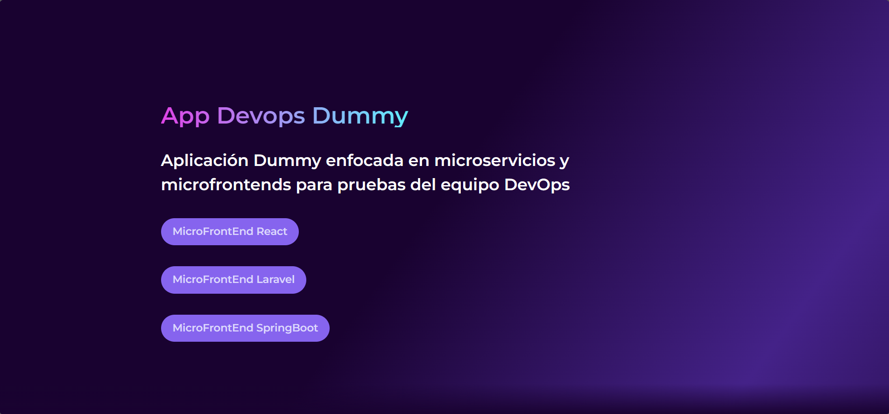

# **DEVOPS DUMMY - PRINCIPAL**
# **ASTRO**

## Descripción del proyecto
Este proyecto es el FrontEnd principal de la aplicación dummy contenerizada, desarrollada con `Astro`. Las pruebas unitarias se están implementando utilizando `Vitest`.

## Funcionamiento
Este proyecto funciona disponiendo botones que consultan las URL de los proyectos Dummy de React, Laravel y Springboot. (FALTA IMPLEMENTAR/DESARROLLAR LOS MICROFRONTENDS DE ANGULAR Y NEXTJS)



## Objetivo
El objetivo principal de este proyecto es proporcionar un proyecto de prueba para el equipo DevOps. Se utiliza para realizar pruebas de los pipelines de CI/CD desarrollados en el repositorio `devops-pipeline-cicd`. 

Los pasos del pipeline incluyen:

- Compilación de código.
- Ejecución de pruebas unitarias.
- Despliegue de imágenes a Azure Container Registry.
- Despliegue de la aplicación en OpenShift preproductivo y productivo en el namespace `devopsdummy`.

---

## **Implementación en local de la aplicación Dummy**
Para desplegar localmente la aplicación Dummy, se pueden seguir dos métodos: sin Docker o con Docker.

### **Opción 1: Instalación sin Docker**
#### **Tecnologías necesarias**
- Node.js
- npm o yarn
- git

#### **Pasos de instalación y ejecución**
1. Clonar el repositorio:
   ```sh
   git clone https://AlcaldiaMedellin@dev.azure.com/AlcaldiaMedellin/DevOps%20Dummy/_git/devopsdummy-astro-principal-mfe-frontend
   ```
2. Ingresar a la carpeta del proyecto:
   ```sh
   cd devopsdummy-astro-principal-mfe-frontend
   ```
3. Instalar dependencias:
   ```sh
   npm install
   ```
4. Iniciar el proyecto en modo desarrollo (esto solo inicia el servidor, no ejecuta pruebas unitarias):
   ```sh
   npm run dev
   ```
5. Acceder a la aplicación en el navegador: [http://localhost:4321](http://localhost:4321)
6. (Opcional) Ejecutar pruebas unitarias: (EN CONSTRUCCIÓN)
   ```sh
   npm test
   ```
7. (Opcional) Ejecutar pruebas unitarias con cobertura:
   ```sh
   npm test -- --coverage
   ```

---

### **Opción 2: Instalación con Docker**
#### **Tecnologías necesarias**
- Docker Desktop
- git

#### **Pasos de instalación y ejecución**
1. Abrir Docker Desktop y asegurarse de que esté en ejecución.

2. Clonar el repositorio:
   ```sh
   git clone https://AlcaldiaMedellin@dev.azure.com/AlcaldiaMedellin/DevOps%20Dummy/_git/devopsdummy-astro-principal-mfe-frontend
   ```
3. Ingresar a la carpeta del proyecto:
   ```sh
   cd devopsdummy-astro-principal-mfe-frontend
   `````
4. Construir la imagen Docker:
   ```sh
   docker build -t devopsdummyastro:1 .
   ```
5. Ejecutar el contenedor:
   ```sh
   docker run -p 4321:4321 devopsdummyastro:1
   ```
6. Acceder a la aplicación en el navegador: [http://localhost:4321](http://localhost:4321)

---

